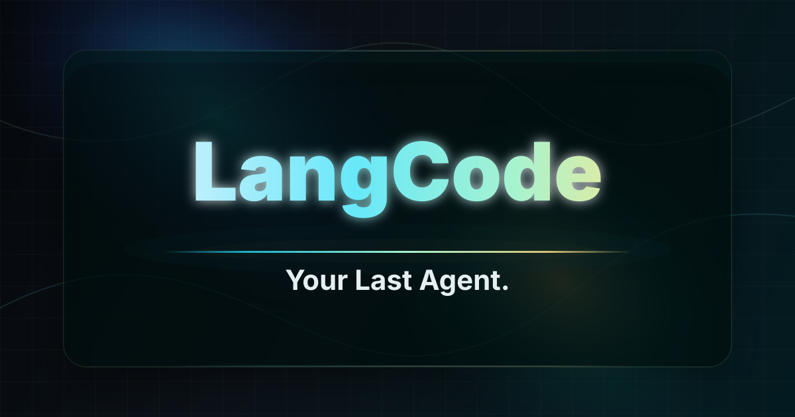

<p align="center">
  
  
  
  
  <a href="LICENSE"></a>
</p>

# LangCode Agent



LangCode，特点：1. LangChain + LangGraph + LLM = Agent Loop；2. Full-Duplex + Barge-in 语音交互。

## Mac 本地一键启动

clone 仓库后，在项目根目录执行：

```bash
./scripts/start_macos.sh
```

脚本会自动完成：

- 检查 Python 3.11+ 和 npm。
- 创建 `.venv`，按 `constraints.txt` 安装依赖；依赖文件没变就跳过（见 [跳过重复安装](#跳过重复安装)）。
- 如果没有 `.env.local`，从 `.env.example` 复制一份本地配置模板。
- 安装前端依赖；`frontend/dist` 比源码新就跳过 `npm run build`。
- 启动 Sanic Web server，默认地址为 `http://127.0.0.1:8765`。

不需要语音时用 `LANGCODE_VOICE=0 ./scripts/start_macos.sh`，只装 core（约 164MB，冷装 1 分钟），server 以 `--no-voice` 启动。

首次启动前，请把 `.env.local` 里的模型或搜索 API key 替换为真实值；没有 key 时页面可以打开，但 chat 请求会返回配置错误。常用覆盖参数：

```bash
LANGCODE_PORT=9000 ./scripts/start_macos.sh
LANGCODE_WORKSPACE=../some-project ./scripts/start_macos.sh
```

Redis 不是本地单机启动的必需项；未启用或不可用时，运行态会回退到进程内存。

发布前可以执行：

```bash
python3 scripts/check_release.py
```

它会检查一键启动所需源码文件、`.gitignore` 对密钥/模型/运行态文件的保护，以及源码中是否误写了常见真实 token。

## 安装

依赖分成 **core** 和 **voice** 两层。core 是 agent、CLI、Web server 在模块顶层真正 import 的那些包；所有语音模型（torch、transformers、mlx、mlx-audio、librosa、scipy、onnxruntime、silero-vad、qwen-asr、kaldi-native-fbank）都是函数内部的惰性 import，因此不装 voice 也能正常启动 Web server，只是语音功能关闭。

```bash
# 只装 core：约 77 个包 / 164MB，冷装约 1 分钟
python3 -m pip install -e . -c constraints.txt

# core + 语音（Apple silicon）
python3 -m pip install -e ".[voice]" -c constraints.txt
python3 -m pip install --no-deps -c constraints.txt -r requirements-voice-nodeps.txt

# 开发（pytest）
python3 -m pip install -e ".[dev]" -c constraints.txt
```

如果不安装，直接从源码树运行：

```bash
PYTHONPATH=src python3 -m langcode_agent.interfaces.cli --workspace .
```

### constraints.txt：为什么必须带 `-c`

`constraints.txt` 把所有存在版本冲突的包钉死到一组已知可用的版本。不带它的时候 pip 每次都要重新解析依赖：`mlx-audio` 会被从 0.5.3 一路回溯到 0.2.10（16 个版本全部下载一遍），`gradio` 再试 4 个版本，实测 5 分钟都跑不完。带上 `-c constraints.txt` 之后回溯次数为 0。

只钉真正会冲突的包，其余交给 pip，这样这个文件不会因为无关的上游发版而失效。三个关键的钉子：

- `numpy==2.2.6`：`librosa` 依赖的 `numba` 要求 `numpy<2.3`。core 单独装会解析到 2.5.x，之后装 voice 就得降级。
- `huggingface_hub==0.36.2`：`transformers==4.57.6` 要求 `<1.0`。
- `transformers==4.57.6`：`qwen-asr==0.0.6` 的硬性 pin。

### 为什么 qwen-asr / mlx-audio 要用 `--no-deps`

这三个包的元数据互相矛盾，pip 永远解不出来：

| 包 | 声明的依赖 |
| --- | --- |
| `qwen-asr==0.0.6` | `transformers==4.57.6`，外加 gradio / flask / accelerate / sox / pytz / qwen-omni-utils / soynlp |
| `mlx-audio==0.4.3` | `transformers>=5.5.0`、`huggingface_hub>=1.0` |
| `mlx-lm==0.31.3` | `transformers>=5.0.0` |

而实际能跑起来的组合就是 `transformers 4.57.6` + `mlx-audio 0.4.3`。所以我们不让 resolver 去推导，直接用 `--no-deps` 断言它（版本见 `requirements-voice-nodeps.txt`），它们真正会 import 的依赖已经写进 `[voice]` extra。

### 自定义音色为什么还要装 `mlx-audio-plus`

`.langcode/tts-models/Fun-CosyVoice3-0.5B-2512-8bit` 的 `config.json` 里 `model_type` 是 `cosyvoice3`，而 `mlx_audio.tts.utils` 加载模型的方式是直接 `importlib.import_module("mlx_audio.tts.models.<model_type>")`——**没有任何注册表 / entry-point 可以挂钩**，模块必须真实存在于磁盘上。

问题是 PyPI 上的 `mlx-audio` **从 0.4.3 到最新的 0.5.3 全都不带 cosyvoice3**（逐个 wheel 解包验证过）。真正提供它的是 `mlx-audio-plus`（[DePasqualeOrg/mlx-audio-plus](https://github.com/DePasqualeOrg/mlx-audio-plus)，MIT），一个把文件直接装进 `mlx_audio` 命名空间的 fork，它提供：

| 模块 | 谁在用 |
| --- | --- |
| `mlx_audio/tts/models/cosyvoice3` | 模型本体 |
| `mlx_audio/tts/models/cosyvoice2` | 同上系列 |
| `mlx_audio/codec/models/s3gen` | `voice/mlx_cosyvoice3.py` 直接 import |
| `mlx_audio/codec/models/s3tokenizer` | `voice/mlx_cosyvoice3.py` 直接 import |

少了它，服务器只会打印 `Model type cosyvoice3 not supported for tts.`，汪菊 / 雪芬两个音色完全不可用。

两个坑：

- **安装顺序**。它会覆盖 `mlx-audio 0.4.3` 名下的 250 个文件，所以必须装在 `mlx-audio` **之后**。pip 不保证 requirements 文件内部的安装顺序，因此它没有写进 `requirements-voice-nodeps.txt`，而是由 `scripts/start_macos.sh` 单独一条 `pip install` 执行。
- **`einops`**。它只声明在 `mlx-audio-plus` 的 `tts` extra 里，被 `--no-deps` 跳过，但 cosyvoice3 的加载路径确实会走到，缺了就是 `ModuleNotFoundError: No module named 'einops'`。已经补进 `[voice]` extra。

它自己声明的是 `transformers<5.0.0,>=4.49.0`，和我们钉的 4.57.6 兼容；仍然用 `--no-deps` 是因为它还声明了 `mlx-lm<0.30.0`（我们跑 0.31.3，实测没问题）和一整条 `mlx-audio[all]` 尾巴。

每次 `LANGCODE_VOICE=1` 启动时，`scripts/start_macos.sh` 都会跑一次
`python scripts/prepare_mlx_cosyvoice3.py --check-overlay --repair-overlay`
做幂等校验：只 stat 几个路径，不 import 任何重包；发现 overlay 被别的 pip 命令覆盖掉了就自动重装。

顺带省掉 qwen-asr 那条只服务 demo 的尾巴（约 250MB）：`gradio` 只在 `qwen_asr/cli/demo.py` 里 import，`flask` 只在 `cli/demo_streaming.py`，`soynlp` 只在 forced aligner 的韩文分支里惰性 import——这些代码路径我们一行都不会走。但 `nagisa` 是 `qwen_asr/__init__.py` 的顶层 import，必须装；它依赖的 `dyNET38==2.2` **只有 cp312 / macOS arm64 的 wheel**，所以语音这一层目前锁定 Python 3.12。

### 关闭语音：`LANGCODE_VOICE=0`

```bash
LANGCODE_VOICE=0 ./scripts/start_macos.sh
```

此时启动脚本只装 core，并给 server 传 `--no-voice`，不加载任何本地 ASR/TTS 模型。也可以直接用命令行开关：

```bash
PYTHONPATH=src python3 -m langcode_agent.interfaces.web --workspace . --no-voice
```

`--no-voice` 和 `LANGCODE_VOICE=0` 等价（显式的命令行参数优先）。设置了 `LANGCODE_VOICE_WORKER_URL` 时，远端 voice worker 仍然可用。

### 跳过重复安装

`scripts/start_macos.sh` 会把 `pyproject.toml` + `constraints.txt` + `requirements-voice-nodeps.txt` + 当前 `LANGCODE_VOICE` 取值的 sha256 写到 `.venv/.langcode-install-stamp`。stamp 没变就跳过 `pip install`（并打印跳过原因）。stamp 只在整个安装成功之后才写入，所以中途 Ctrl-C 下次会重试。需要强制重装：

```bash
LANGCODE_FORCE_INSTALL=1 ./scripts/start_macos.sh
```

前端同理：只有当 `frontend/src`、`frontend/index.html`、`frontend/package.json`、`frontend/vite.config.js` 里有文件比 `frontend/dist/index.html` 新时才跑 `npm run build`。

### 升级版本后怎么刷新 constraints.txt

```bash
python3 -m venv /tmp/lc-pin
/tmp/lc-pin/bin/pip install -e ".[voice]"          # 先不带 -c，让 pip 自由解析
/tmp/lc-pin/bin/pip install --no-deps -r requirements-voice-nodeps.txt
/tmp/lc-pin/bin/pip freeze                          # 把相关行抄回 constraints.txt
rm -rf /tmp/lc-pin
```

改完用这条确认没有回溯（必须输出 `0`）：

```bash
pip install --dry-run -e ".[voice]" -c constraints.txt 2>&1 | grep -c "looking at multiple versions"
```

注意不要在项目自己的 `.venv` 里做这件事，否则 stamp 和实际内容会对不上。

## 模型配置

自然语言对话通过 `langchain-openai` 使用 OpenAI-compatible chat model。

默认 provider 是智谱：

```bash
export LANGCODE_PROVIDER="zhipu"
export ZHIPU_API_KEY="..."
export LANGCODE_MODEL="glm-5.1"
```

默认智谱设置：

- base URL: `https://open.bigmodel.cn/api/paas/v4`
- model: `glm-5.1`

不要把真实 API key 放进 tracked 文件。请使用 shell 环境变量，或使用被忽略的本地 env 文件。

也支持 AIMP 网关的 GPT-4o。该接口按 OpenAI-compatible chat completions 接入，并额外发送 `Aimp-Biz-Id` 和 `AIGC-USER` headers：

```bash
export LANGCODE_PROVIDER="openai"
export LANGCODE_OPENAI_GATEWAY="aimp"
export LANGCODE_MODEL="gpt-4o"
export AIMP_GPT4O_BASE_URL="https://aimpapi.midea.com/t-aigc/mip-chat-app/openai/standard/v1"
export AIMP_GPT4O_USER="..."
export AIMP_GPT4O_API_KEY="..."
```

Web 左下角设置里的模型下拉框可直接选择 `AIMP GPT-4o`。

Web 搜索/抓取使用 LangChain 官方 Tavily 集成 `langchain-tavily`：

```bash
export LANGCODE_WEB_SEARCH_PROVIDER="tavily"
export TAVILY_API_KEY="..."
```

当前实现默认使用 Tavily `basic` search，普通搜索每次消耗 1 credit。真实 key 请放在 `.env.local` 或 shell 环境变量中，不要写入 tracked 文件。

## 语音与本地模型

仓库会提交小体积的产品资产：

- `.langcode/skills/process-relation-diagram/SKILL.md`：内置流程/关系图示 skill。
- `.langcode/tts-voices/samples/`：`汪菊`、`雪芬` 的运行时音色样本。
- `.langcode/tts-voices/profiles/`：两套音色 profile，避免用户首次使用时必须重新提取。
- `.langcode/tts-voices/previews/`：Web UI 里可直接试听的内置音色预览。

仓库不会提交大模型、数据库、缓存和会话状态。当前本机 `.langcode` 里这些内容体积较大，需要 clone 后按需下载或自动生成：

| 路径 | 用途 | 是否提交 | 准备方式 |
| --- | --- | --- | --- |
| `.langcode/asr-models/Qwen3-ASR-0.6B` | 语音输入 ASR | 不提交，约 1.8GB | 可让 Transformers 自动下载，或运行 `python3 scripts/download_asr_model.py` |
| `.langcode/turnsense-models/TurnSense` | 语义 VAD / 说话轮次结束判断 | 不提交，约 100MB | 运行 `python3 scripts/download_turnsense.py` |
| `.langcode/tts-models/Fun-CosyVoice3-0.5B-2512-8bit` | `汪菊`、`雪芬` 自定义音色合成 | 不提交，约 1.3GB | 运行 `python3 scripts/download_tts_model.py` |
| `.langcode/web.sqlite`、`.langcode/checkpoints.sqlite` | Web 会话和 LangGraph checkpoint | 不提交 | 首次启动自动创建 |
| `.langcode/cache/`、`.langcode/artifacts/` | 本地缓存和大工具结果 | 不提交 | 运行时自动创建 |

一键准备本地语音模型和自定义音色：

```bash
python3 scripts/download_asr_model.py
python3 scripts/download_turnsense.py
python3 scripts/download_tts_model.py
PYTHONPATH=src python3 scripts/prepare_mlx_cosyvoice3.py
```

语音输入默认使用 Qwen3-ASR。Mac 上可显式使用 Apple MPS：

```bash
export LANGCODE_ASR_DEVICE="mps"
export LANGCODE_ASR_DTYPE="auto"
```

语音播报支持两类路径：

- 默认音色：使用 macOS `say`，不需要额外模型。
- 自定义音色：使用本地 MLX/CosyVoice3。模型体积较大，不提交到 GitHub；clone 后运行 `scripts/download_tts_model.py`，或把 MLX 兼容模型放到本地并通过环境变量指向它。

自定义音色推荐配置：

```bash
export LANGCODE_TTS_PROVIDER="auto"
export LANGCODE_TTS_MODEL_DIR=".langcode/tts-models/Fun-CosyVoice3-0.5B-2512-8bit"
export LANGCODE_TTS_VOICE_DIR=".langcode/tts-voices"
export LANGCODE_TTS_WORKERS="2"
```

内置的 `汪菊`、`雪芬` 自定义音色样本同时保留在仓库根目录和 `.langcode/tts-voices/samples/`。如果需要重新生成音色 profile 和预览：

```bash
PYTHONPATH=src python3 scripts/prepare_mlx_cosyvoice3.py \
  --model-dir "$LANGCODE_TTS_MODEL_DIR" \
  --voice-dir .langcode/tts-voices
```

如果模型或样本不存在，Web 页面仍能启动；自定义音色会不可用或回退，默认音色仍可使用 macOS `say`。

如果要切换到另一个 OpenAI-compatible 网关：

```bash
export LANGCODE_PROVIDER="openai"
export OPENAI_BASE_URL="https://your-compatible-endpoint/v1"
export OPENAI_API_KEY="..."
export LANGCODE_MODEL="your-model"
```

如果没有配置 API key，可以使用 raw tool 模式做本地验证：

```bash
mkdir -p "${TMPDIR:-/tmp}/langcode-demo"
PYTHONPATH=src python3 -m langcode_agent.interfaces.cli --workspace "${TMPDIR:-/tmp}/langcode-demo" --raw-tools
```

## CLI 使用

启动一个 chat session：

```bash
langcode-agent --workspace . --session default
```

继续同一个 session：

```bash
langcode-agent --workspace . --session default
```

session 状态保存在：

```text
<workspace>/.langcode/
```

CLI 也支持通过 `:tool` 直接调用工具：

```text
:tool {"name":"read_file","args":{"path":"README.md"}}
```

raw tool 模式只接受 JSON 工具调用：

```text
{"name":"write_file","args":{"path":"README.md","content":"hello"}}
```

## Web UI

React Web UI 提供类似 Claude/GPT 的代码工作台：左侧是 session 和设置，中间是对话界面，输入框附近显示审批项。

Mac 本地推荐直接使用一键脚本：

```bash
./scripts/start_macos.sh
```

安装前端依赖并构建：

```bash
cd frontend
npm install
npm run build
```

从项目根目录启动异步 Sanic Web server：

```bash
PYTHONPATH=src python3 -m langcode_agent.interfaces.web \
  --workspace . \
  --frontend-dir frontend/dist \
  --port 8765
```

打开：

```text
http://127.0.0.1:8765
```

Web UI 使用与 CLI 相同的智谱/OpenAI-compatible 环境变量。如果没有模型 key，chat 请求会显示可操作的错误提示。

Web server 使用 Sanic 异步 HTTP 层。阻塞的模型调用和工具执行会放到线程中运行，同一 session 的请求会串行化，避免并发修改同一段消息历史；不同 session 的请求可以并发处理。

当前 Web UI 能力：

- 页面铺满整个浏览器视口，页面本身不随上下滚动。
- 中间对话区较宽，两侧栏较窄。
- 模型输出通过 `/api/chat-stream` 流式显示。
- 输入框默认单行，按 Enter 提交，Shift+Enter 换行。
- 写文件、编辑文件和 shell 审批项显示在输入框上方。
- 当前工作目录和刷新按钮位于输入框下方；点击文件夹图标会打开本机目录选择弹窗。
- 左侧底部设置按钮可选择模型和界面语言，支持中文和英文。
- 左侧栏显示所有 Web 会话，点击会加载历史消息；每个会话右侧有三点菜单，可重命名或删除该会话。
- Assistant 回复会实时渲染 Markdown，支持 GFM 表格和 LaTeX 数学公式。
- 支持本地命令：
  - `/compact [说明]`：压缩当前会话上下文，保留最近消息，把较早消息汇总为系统摘要，并在 `.langcode/compactions/` 归档完整压缩前历史。
  - `/memory`：查看当前可加载的项目记忆和指令。
  - `/agents`：查看内置只读子 Agent。
  - `# 记忆内容`：写入 `.langcode/memories/MEMORY.md`，后续会话系统提示会自动加载。
- 模型可调用 `delegate_agent` 只读子 Agent，在独立上下文中执行 researcher/reviewer/planner 类型的检索、审查或规划任务。

## 工具

- `read_file`：读取工作区内 UTF-8 文本文件。
- `search`：在工作区内搜索，优先使用 `rg`。
- `web_search`：通过 Tavily 搜索公网网页，用于当前文档、新闻、API 参考和外部资料检索。
- `web_fetch`：通过 Tavily 抓取指定公网 URL 的可读 Markdown 内容；会拒绝 localhost、`.local`、私有/保留 IP。
- `write_file`：写入工作区内 UTF-8 文本文件。
- `edit_file`：替换工作区内 UTF-8 文本文件内容。
- `shell`：在工作区内带超时运行 shell 命令。低风险且不逃逸 workspace 的命令会自动执行；危险命令、路径逃逸或命中 ask 规则时进入人工审批。
- `delegate_agent`：启动只读子 Agent，支持 `researcher`、`reviewer`、`planner` 三种角色。子 Agent 只能使用 `read_file`、`search`、`web_search` 和 `web_fetch`，不会写文件或执行 shell。

## 权限模型

- `read_file`、`search`、`web_search` 和 `web_fetch` 自动允许；`web_fetch` 只允许公网 `http(s)` URL。
- `write_file` 和 `edit_file` 需要人工审批。
- `shell` 对齐 Claude Code 的权限规则思路：`deny` 优先，其次 `allow`，再看 `ask` 和风险分类；普通低风险命令自动通过。
- 审批选项为 `accept`、`reject`、`edit` 和 `feedback`。
- 路径会基于 workspace root 解析，路径逃逸会被拒绝。
- shell 命令带超时运行；需要审批时会显示风险摘要。Web 审批里的“允许并记住”会把当前命令写入 `<workspace>/.langcode/settings.json`：

```json
{
  "permissions": {
    "allow": ["Bash(mkdir output)"],
    "ask": ["Bash(git push*)"],
    "deny": ["Bash(curl *)"]
  }
}
```

## 恢复与记忆

运行时 session 状态保存在 `<workspace>/.langcode/`。该目录下只有内置 skill 和小体积音色资产会随仓库提交，运行态数据仍被忽略。
Web 会话、消息内容、重命名/删除等操作事件保存在 `<workspace>/.langcode/web.sqlite`。旧版 `.langcode/web-sessions/*.json` 和 `.langcode/web-session-metadata.json` 会在启动时自动迁移进 SQLite；迁移后不会再写新的 Web 会话 JSON 文件。
LangGraph 工具审批/恢复 checkpoint 仍单独保存在 `<workspace>/.langcode/checkpoints.sqlite`，它不承载左侧栏会话列表。
上下文压缩归档保存在 `<workspace>/.langcode/compactions/`。
Hermes 热记忆保存在 `<workspace>/.langcode/memories/MEMORY.md` 和 `<workspace>/.langcode/memories/USER.md`。启动新会话或继续旧会话时，LangCode 会刷新自己的系统提示，让旧会话也读取新的 Hermes 热记忆；旧版 `<workspace>/.langcode/MEMORY.md` 不再作为项目上下文加载。

当前已验证的 LangChain/LangGraph 版本组合：

- `langchain==1.3.1`
- `langgraph==1.2.0`
- `langchain-core==1.4.0`
- `langchain-openai==1.2.1`
- `langchain-tavily`
- `langgraph-checkpoint-sqlite==3.1.0`

## 开发

运行测试：

```bash
python3 -m pytest tests -q
```

构建前端：

```bash
cd frontend
npm run build
```

不依赖 API key 的本地 smoke test：

```bash
SMOKE_WORKSPACE="${TMPDIR:-/tmp}/langcode-smoke"
mkdir -p "$SMOKE_WORKSPACE"
printf '%s\n' \
  '{"name":"write_file","args":{"path":"README.md","content":"smoke"}}' \
  'accept' \
  'quit' \
  | PYTHONPATH=src python3 -m langcode_agent.interfaces.cli --workspace "$SMOKE_WORKSPACE" --session smoke --raw-tools
```

## GitHub 发布前检查

建议提交源码、测试、README、`pyproject.toml`、`frontend/package.json`、`frontend/package-lock.json`、`.env.example`、`scripts/*.py` / `scripts/*.sh`、`assets/github-poster.svg`、根目录两份内置音色样本，以及 `.langcode/skills/` 和 `.langcode/tts-voices/` 下被放开的内置资产。提交前运行：

```bash
python3 scripts/check_release.py
```

不要提交以下本地生成或敏感内容，它们已由 `.gitignore` 覆盖：

- `.env.local`、`.env` 等真实密钥配置。
- `.gstack/`、SQLite 运行态、日志、`.langcode/cache/`、`.langcode/artifacts/`、`.langcode/memories/`。
- `.venv/`、`frontend/node_modules/`、`frontend/dist/`。
- `__pycache__/`、`.pytest_cache/`、`*.pyc`。
- 本地大模型、checkpoint、临时录音和服务测试音频，例如 `.langcode/asr-models/`、`.langcode/tts-models/`、`.langcode/turnsense-models/`、`*.pt`、`*.safetensors`、`models/`；根目录 `汪菊.wav`、`雪芬.wav` 和 `.langcode/tts-voices/` 下的内置样本/profile/预览会随项目提交。
